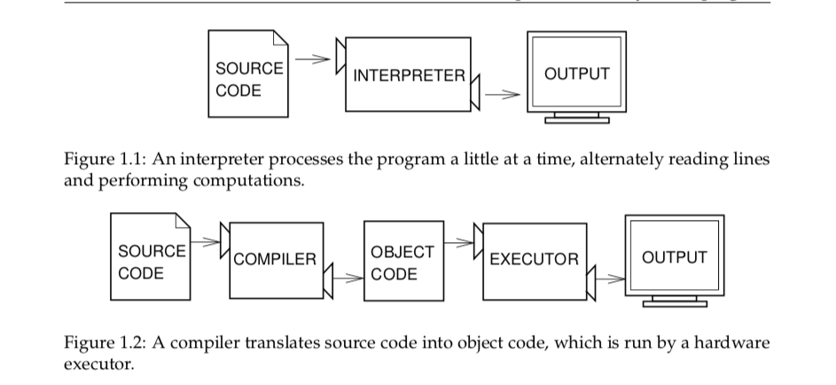
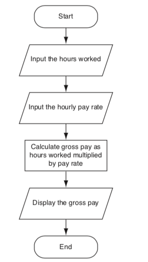

# COURSE OVERVIEW & INTRODUCTION TO PROGRAMMING & PYTHON

## AGENDA
- Introduction to the course
    + course purpose
    + grade components, course policies, outline of topicps covered this semester
- Introduction to programming & python
    + problem solving
    + what are computer programs? how do they work?
    + process of writing computer programs
    + python overview
        + installation & usage (python 3, jupyter lab)
    + python style conventions
  

## 1. COURSE OVERVIEW

#### Purpose: 
    - Computational thinking
    - fundamental programming concepts
    - problem formulating and solving
    
#### Grade Components:
    - Assignments, Projects, Exams
    
#### Course Materials

#### Class Format

#### Communication Policy

#### Late Work Policy

#### Academic Integrity


## 2. INTRODUCTION TO PROGRAMMING & PYTHON

## Programming Basic Concepts

### Problem-solving

### What is a program?
- Sequence of instructions spceifying how to perform a computation (mathematical or symbolic)
    - Input
    - Output
    - Math
    - Conditional Execution
    - Repetition
    
- Decomposition
    
### Debugging
    - syntax erros
    - runtime errors
    - semantic erros

### Formal and Natural Languages
- Natural Language: how we speak/write/communicate with each other
- Formal Languages:
    - designed for specific applications
    - strict syntax rules
    - e.g. mathmatical notations, computer programming languages, chemical formulas
- Tokens, Structure
- Ambiguity
- Redundancy
- Literalness
- Parsing


### Why Python
- Data Analytics
- General Purpose
- Power, Popularity
- Clarity, Simplicity, Efficiency


### History of Python

- Developed by 
    - **Guido van Rossum**, a Dutch programmer
- First Release: 1991
- **Monty Python**
    - *spam, eggs, 42, etc.*
    - *Brian, ni, shrubbery, ...*
    - *"The Spanish Inquisition"*

### More About Python

- **A High-level language**
     - Other high-level languages?
     - What are low-level languages?
     - High vs. Low level language


### More About Python
- **Interpreted language**
    - compiler vs. interpreter
    



### More About Python
- **.pyc files**:
    - Intermediate file used by the Python interpreter. 
    - Technically, Python uses a hybrid compiling/interpreting process. 
    - The Python source code, when executed, is compiled into more primitive instructions called byte code. 
    - This byte code (the . pyc) is then interpreted. 
    - Having a . pyc file available makes running a module faster the second time around.
    - However, you may delete it if you wish to save disk space; Python will automatically recreate it as needed.

### Writing and Running Python Code

- **Ways to use the interpreter when programming in Python**:
    - Interactive Mode
    - Script mode
        - **.py** files
        - to run a .py file: ` python myfile.py`
 
- **IDEs (Integrated Development Environments) & Text Editors**


### Important to Know about Python

- Case Sensitive
    - e.g. token, TOKEN 
    - `print('hello')`,  NOT `Print('hello')` or `PRINT ('hello')`
- Indentation
    - Python convention: 4 spaces. Usually 1 tab = 4 spaces
    - Only tab or spaces, NOT both
- Colon
-  Equal Signs
    - `=`  for assigning variables' values
    - `==` for  comparing between two variables/values 


```python
print("hello")
```

    hello
    


```python
Print("hello")
```


    ---------------------------------------------------------------------------

    NameError                                 Traceback (most recent call last)

    <ipython-input-25-fb066905c7fb> in <module>
    ----> 1 Print("hello")
    

    NameError: name 'Print' is not defined


```python
x = 8
if x < 10:
    ## 
    print("x is smaller than 10") 
```


      File "<ipython-input-28-fc7d7acc3b43>", line 2
        if x < 10
                 ^
    SyntaxError: invalid syntax
    


```python
x = 8
n = 6
n
print(n)
```

    6
    


```python
if x == 10:
    print("x is equal to 10")
else:
    print("x is not equal to 10")
```

    x is not equal to 10
    

### Jupyter Notebook 

- What's a "notebook"?
    - contains both code and rich text elements
        -  figures, links, equations, etc.
- For more information: https://www.datacamp.com/community/tutorials/tutorial-jupyter-notebook#WhatIs
- New developments: **Jupyter Lab** - a browser-based IDE which has tabs that contain Jupyter notebooks

### Installation

Anaconda: https://docs.anaconda.com/anaconda/install/

Python: https://www.python.org/downloads/

pip: https://pip.pypa.io/en/stable/reference/pip_download/

Jupyterlab: https://jupyterlab.readthedocs.io/en/stable/getting_started/installation.html

### Jupyter Notebook (cont.)

-  Self-contained cells:
    - **Ju**lia, **Pyt**hon, **R**
    - Markdown, Latex, HTML, javascript etc.

- Now can run many other languages

### Using Jupyter Notebook
- File menu => create new Jupyter Notebooks (.ipynb)
- Export to other formats :
    - .py, .html, .pdf, .md, .reST
- Menu options under:
    - File, Edit, Insert, Cell, Kernel
- Keyboard shortcuts:
    - https://www.cheatography.com/weidadeyue/cheat-sheets/jupyter-notebook/


```python
# This is an example of Code Cell
print ('use shift+enter to run code in a cell, and select the next cell')
print('use control + enter to run code in a cell')
```

    use shift+enter to run code in a cell, and select the next cell
    use control + enter to run code in a cell
    


```python
print("Hello")
```

    Hello
    


```python
help()
```

    
    Welcome to Python 3.9's help utility!
    
    If this is your first time using Python, you should definitely check out
    the tutorial on the Internet at https://docs.python.org/3.9/tutorial/.
    
    Enter the name of any module, keyword, or topic to get help on writing
    Python programs and using Python modules.  To quit this help utility and
    return to the interpreter, just type "quit".
    
    To get a list of available modules, keywords, symbols, or topics, type
    "modules", "keywords", "symbols", or "topics".  Each module also comes
    with a one-line summary of what it does; to list the modules whose name
    or summary contain a given string such as "spam", type "modules spam".
    
    
    You are now leaving help and returning to the Python interpreter.
    If you want to ask for help on a particular object directly from the
    interpreter, you can type "help(object)".  Executing "help('string')"
    has the same effect as typing a particular string at the help> prompt.
    

#### Tab Completion

#### Magic Commands
- Insert a code cell below, and try these commands
    - `%magic`
    - `%lsmagic`
    - `%cd`
    - `%pwd`
    - `%mkdir`
    - ``%who``
    - ``%who str``
    - ``%system date``
- To use other languages than Python in code cells:
    - `%%latex`
    - `%%html`
    - `%%javascript`
    - `%%r`
- More magic commands:
    - `%load` replaces the contents of the current cell with an external script
    - `%run` executes code from .py and .ipynb files and shows output
    - `%%writefile test.py` saves the contents of that cell to a file named 'test.py'
        - if want to add the content to an existing file, use `%%writefile -a existingfile.py` (means to append)
    - `%pycat test.py` shows you (in a popup) the syntax highlighted contents of an external file.


#### os commands
- `import os`
- `os.sep` outputs the (or a most common) pathname separator ('/' or '\\')
- `os.name`
- `os.getcwd()`


```python
#?os
import os
os.sep
os.linesep
os.name
os.getcwd()
```


    'C:\\Users\\Yuxiao Luo\\Documents\\python3\\CIS2300\\wk1_intro'


### Creating Programs:

#### Steps
#### Algorithms
#### Pseudo code
#### Flowchart


### Steps for Creating Programs:
Programming Process

### Algorithms
1. Pour the desired amount of water into a pot.
2. Put the pot on a stove burner.
3. Turn the burner to high.
4. Watchthewateruntilyouseelargebubblesrapidlyrising.Whenthishappens,the
water is boiling.

### Algorithms
1. Get the number of hours worked.
2. Get the hourly pay rate.
3. Multiply the number of hours worked by the hourly pay rate.
4. Display the result of the calculation that was performed in step 3.

### Pseudo Code Example
1. Input the hours worked
2. Input the hourly pay rate
3. Calculate gross pay as hours worked multiplied by pay rate 
4. Display the gross pay


```python
## 1. request the # of hours worked

## 2. request the hourly pay rate

## 3. calculate the gross pay

## 4. display gross pay
```

### Flowchart




### How do Computer Programs Work?
Typically:
1. Input is received.
2. Some process is performed on the input. 
3. Output is produced.

### Displaying Output with `print` function

`print('Hello world')`


```python
print('Kate Austen')
print('123 Full Circle Drive')
print('Asheville, NC 28899')
```

    Kate Austen
    123 Full Circle Drive
    Asheville, NC 28899
    

### Strings
- Quotation marks:
    - Double
    - Single
    - Tripple


```python
print("Kate Austen")
print("123 Full Circle Drive")
print("Asheville, NC 28899")
```

    Kate Austen
    123 Full Circle Drive
    Asheville, NC 28899
    


```python
print('Kate Austen')
```

    Kate Austen
    


```python
print("""Kate Austen \n123 Full Circle Drive, Asheville, NC 28899
""")
```

    Kate Austen 
    123 Full Circle Drive, Asheville, NC 28899
    
    


```python
print("""\nKate Austen \n123 Full Circle Drive \nAsheville, NC 28899
""")
```

    
    Kate Austen 
    123 Full Circle Drive 
    Asheville, NC 28899
    
    


```python
print('Your assignment is to read "Hamlet" by tomorrow.')
```

    Your assignment is to read "Hamlet" by tomorrow.
    


```python
print(""" I'm reading "Hamlet" tonight.""")
```

    I'm reading "Hamlet" tonight.
    


```python
print("""
One
Two
Three
""")
```

    
    One
    Two
    Three
    
    


```python
#Write a statement that displays your name.
print("Yuxiao Luo")
```

    Yuxiao Luo
    


```python
#Write a statement that displays the following text: Python's the best!

```


```python
#Write a statement that displays the following text: The cat said "meow."
print('The cat said "meow."')
```

    The cat said "meow."
    

### Comments


```python
# This program displays a person's
# name and address.
print('Kate Austen')
print('123 Full Circle Drive')
print('Asheville, NC 28899')
```

### Receiving Input
2 ways:

    - Variable Assignment
    
    - `input` function


### Variable Assignment
#### variable = expression
= : assignment operator <br>
*variable* is the name of a variable  <br>
*expression* is a value


```python
width = 25
length = 50
#print(width)
print(width)
print(length)

```

    25
    50
    


```python
room = 503
print('I am staying in room', room)
```

    I am staying in room 503
    


```python
503 = room

```


      File "<ipython-input-3-cb8e0bc2153f>", line 1
        503 = room
                  ^
    SyntaxError: can't assign to literal
    


### Variable Reassignment

`cash = 2.5
print('I have', cash, 'dollars in cash right now')
cash = 1.5
print('Now I only have', cash, 'dollars left in cash')`


```python
cash = 2.5
print('I have', cash, 'dollars in cash right now')
cash = 1.5
print('Now I only have', cash, 'dollars left in cash')
```

    I have 2.5 dollars in cash right now
    Now I only have 1.5 dollars left in cash
    


```python
first_name = 
```

Python Variable Naming Rules

legal_illegal


```python
input('What is your name?')
```

    What is your name? Anh Luong
    


    'Anh Luong'


```python
input('Type anything:')
```

    Type anything: Hello
    


    'Hello'


```python
input('Age:')
```


```python
input('What is your major?')
```


```python
input('Length')
```

    Length 3
    


    '3'


```python
input('Width')
```


```python
print('width')
```


```python
age = input('How old are you?')
#print(age)
age
print("The user is", age, "years old")
```

    How old are you? 25
    

    The user is 25 years old
    


```python
name = input("What's your name?")
```

### Variable Types
#### Strings (str)
#### Numeric: 
    - integer (int) 
    - float (float)


```python
number = 5
type(number)
```


    int


```python
number = 5.5
type(number)
```


    float


```python
name = 'Anh Luong'
type(name)
```


    str


```python
# assigning type to a variable/converting type
variable = 5.6
type(variable)
int(variable)
#type(variable)
#float(variable)
#type(variable)
```


    5


```python
room = input("What room are you staying in?")
```

    What room are you staying in? 1
    


```python
string_value = input('How many hours did you exercise last week? ') 
hours = int(string_value)
```

    How many hours did you work? 10
    


```python
hours = int(input('How many hours did you exercise last week? Enter whole number '))
```


```python
weight = float(input('How many pounds do you weigh?'))
```

    How many hours did you exercise last week?3.5
    

### Simple Programs in Python:


```python
# Greetings Program
user = input('What is your name?')

#print('Hello,', user,'! Welcome to CIS 2300!') 

print('Hello ' + user + '! Welcome to CIS 3120!') # concatenating strings

#print('Hello, ', user, '! Welcome to CIS 3120!', sep = '') 
#sep means separator, here we don't want any space between the name and the exclamation mark
```

    What is your name? Anh
    

    HelloAnh! Welcome to CIS 3120!
    


```python
user = 'Anh Luong'
print('Hello', user, 'Welcome to CIS 2300!')
```

    Hello Anh Luong Welcome to CIS 2300!
    


```python
print('Hello, ' + user + '! Welcome!')
```

    Hello, Anh Luong! Welcome!
    


```python
print("You can concatenate two " + "strings with the '+' operator.")
```

    You can concatenate two strings with the '+' operator.
    


```python
# Silly Strings Program
## break long statements into multiple lines with a line continuation character - the backslash (\)
## \n is for creating a new line - it's the newline escape character

print("\nThis string " + "may not " + "seem terr" + "ibly impressive. " \
      + "But what " + "you don't know" + " is that\n" + "it's one real"  \
      + "l" + "y" + " long string, created from the concatenation " \
      + "of " + "twenty-two\n" + "different strings, broken across " \
      + "five lines." + " Now are you" + " impressed? " + "Okay,\n" \
      + "this " + "one " + "long" + " string is now over!")
```

    
    This string may not seem terribly impressive. But what you don't know is that
    it's one really long string, created from the concatenation of twenty-two
    different strings, broken across five lines. Now are you impressed? Okay,
    this one long string is now over!
    


```python
# Silly Strings Program 2

print("\nIf you really like a string, you can repeat it. For example,")
print("who doesn't like pie? That's right, nobody. But if you really") 
print("like it, you should say it like you mean it:")
print("Pie " * 10) # repeating a string with operator *
input("\n\nEnter any key to exit.") # \n means a new line
print('End of program')
```

    
    If you really like a string, you can repeat it. For example,
    who doesn't like pie? That's right, nobody. But if you really
    like it, you should say it like you mean it:
    Pie Pie Pie Pie Pie Pie Pie Pie Pie Pie 
    

    
    
    Enter any key to exit. 
    

    End of program
    


```python
print("\t\t\tFancy Credits") # \t is for "tab"
print("\t\t\t \\ \\ \\ \\ \\ \\ \\") # \\ causes a backslash character to be printed
print("\t\t\t\tby")
print("\t\t\tMichael Dawson")
print("\t\t\t \\ \\ \\ \\ \\ \\ \\")
print("\nSpecial thanks goes out to:")
print("My hair stylist, Henry \'The Great,\' who never says \"can\'t.\"")
input("\n\nEnter any key to exit.") 
print("End")
```

    			Fancy Credits
    			 \ \ \ \ \ \ \
    				by
    			Michael Dawson
    			 \ \ \ \ \ \ \
    
    Special thanks goes out to:
    My hair stylist, Henry 'The Great,' who never says "can't."
    
    
    Enter any key to exit.
    End
    

### Other Escape Characters:
- `\'`: causes a single quote mark to be printed
- `\"`: causes a double quote mark to be printed


```python
print("I want to see the movie "Bumblebee."")
# fix  the code so that it will execute succesfully
```


      File "<ipython-input-33-aab80a008bdc>", line 1
        print("I want to see the movie "Bumblebee."")
                                                ^
    SyntaxError: invalid syntax
    


```python
print('I'm going to see the movie "Bumblebee") 
#fix the code
```


      File "<ipython-input-35-34ff05adb827>", line 1
        print('I'm going to see the movie "Bumblebee")
                 ^
    SyntaxError: invalid syntax
    


```python
# Division 
print("\nIf a restaurant check comes to 19 dollars with tip, and you and") 
print("your friends split it evenly 4 ways, how much do you each throw in?")
input("Enter any key to find out.")
print("19 / 4 =", 19 / 4)

```

    
    If a restaurant check comes to 19 dollars with tip, and you and
    your friends split it evenly 4 ways, how much do you each throw in?
    Enter any key to find out.
    19 / 4 = 4.75
    


```python
# Division 2

print("\nIf a group of 4 pirates finds a chest full of 107 gold coins, and")
print("they divide them evenly, how many whole coins does each get?") 
input("Enter any key to find out.")
print("107 // 4 =", 107 // 4) 

```


```python
# Division 3

print("\nIf that same group of 4 pirates evenly divides the chest full") 
print("of 107 gold coins, how many coins are left over?")
input("Enter any key to find out.")
print("107 % 4 =", 107 % 4) # remainder
input("\n\nEnter any key to exit.")
print('End.')
```

    
    If that same group of 4 pirates evenly divides the chest full
    of 107 gold coins, how many coins are left over?
    Enter any key to find out.
    107 % 4 = 3
    
    
    Enter any key to exit.
    End.
    

pt_math_operators


```python
# %load dawson_source/chapter02/quotation_manipulation.py
# Quotation Manipulation
# Demonstrates string methods

# quote from IBM Chairman, Thomas Watson, in 1943
quote = "I think there is a world market for maybe five computers."

print("Original quote:")
print(quote)

print("\nIn uppercase:")
print(quote.upper())

print("\nIn lowercase:")
print(quote.lower())

print("\nAs a title:")
print(quote.title())

print("\nWith a minor replacement:")
print(quote.replace("five", "millions of"))

print("\nOriginal quote is still:")
print(quote)

```


```python
var = 5
type(var)
float(var)
name = 'Anh Luong'
type(name)
```


    str


```python
# %load dawson_source/chapter02/useless_trivia.py
# Useless Trivia
#
# Gets personal information from the user and then
# prints true but useless information about him or her

name = input("Hi.  What's your name? ")

age = int(input("How old are you? "))

weight = int(input("Okay, last question.  How many pounds do you weigh? "))

print("\nIf poet ee cummings were to email you, he'd address you as",
      name.lower())
print("But if ee were mad, he'd call you", name.upper())

called = name * 5
print("\nIf a small child were trying to get your attention",)
print("your name would become:")
print(called)

seconds = age * 365 * 24 * 60 * 60
print("\nYou're over", seconds, "seconds old.")

moon_weight = weight / 6
print("\nDid you know that on the moon you would weigh only",
      moon_weight, "pounds?")

sun_weight = weight * 27.1
print("On the sun, you'd weigh", sun_weight, "(but, ah... not for long).")
```

## Assignments 
#### Assignment 1.1
1. 
Install python, jupyter lab/notebook if you haven't done so

2. 
Compplete the Profile Questionnaire on Blackboard
 - What's your major?
 - What kind of programming experience do you already have?
 - Which programming languages have you worked with before and at what level (working knowledge, proficient, fluent)?
 - What do you wish to learn in this course?
 - What are your questions/comments/concerns about this course?
 - What is the hardest concept for you to understand or a concept you don't understand yet after reading Chapter 1?
     

#### Assignment 1.2
1. 
Create two variables that take your first and last name as values and then print it so that you get an output along with a descriptive message before (e.g. My name is ...)

2. 
Create a variable that takes "Hello World" as its value. Find the length of the string using the built-in function len for the string object type (use the Help Menu above). Then print the length of the string with a descriptive message like: The length of the string Hello World is 11

3. 
Write a print statement to print the sentence "I'd like a cup of coffee", and a print statement to print the sentence "She said "With cream and sugar?" "

4. 
Create a list of legal and illegal variable names. Describe why each is either legal or illegal. Next, create a list of “good” and “bad” legal variable names. Describe why each is either a good or bad choice for a variable name.
5.
Modify the Useless Trivia program above so that users' weight value is a float

6. 
Write a program to request the length and breadth of a rectangle and compute the area of the rectangle
